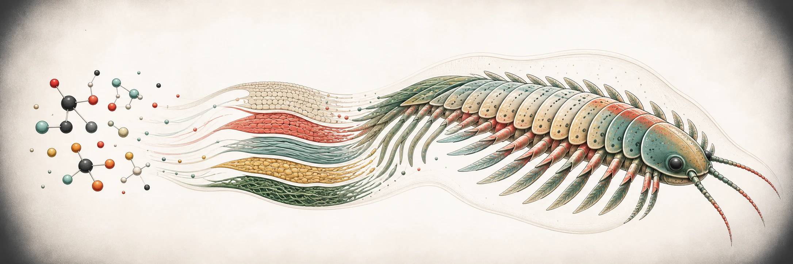

Lifecycle Kit grows procedural creatures from causes rather than an inventory
of authored parts. Chemistry determines tissue, lived diet and activity reshape
that tissue, biological scaling laws set organism-level constraints,
compositional rules emit vector geometry, and pigment plus self-shadowing
produce renderer-neutral visual data.

Every stage is a pure function over plain objects. There is no hidden
randomness, browser global, clock, rendering-engine dependency, or runtime
dependency. That makes a creature serializable, replayable, and safe to grow
in parallel.

## The five stages

- **chem** — elemental properties, biomolecules, metabolism, and tissue composition.
- **bio-laws** — cited allometric relationships for brain mass, life history, and group size.
- **forms** — a small vocabulary of continuous vector rules that emits body plans.
- **pigment** — diet, exposure, tissue, and genetics become a palette ramp.
- **assemblage** — depth sorting, light, shadow, and renderer-neutral 2.5D parts.

The `chem`, `forms`, and `bio-laws` stages also work independently. `pigment`
uses chemistry, while `assemblage` combines form and pigment output.

```text
world abundance + temperature
            │
            ▼
          chem ───────► bio-laws
            │              │
            ▼              │
         pigment           │
            │              │
            └──────┐       │
                   ▼       ▼
forms ─────────► assemblage ──► renderer-ready geometry, colour, depth, light
```

## Choose your entry point

Import the narrowest stage that solves your problem. Subpaths keep bundles
small and make a symbol's provenance clear.

```ts
import { chem, forms } from "@jbdevprimary/lifecycle-kit";

const tissue = chem.normalise({ sugar: 0, protein: 3, lipid: 1, mineral: 0, chitin: 0, keratin: 0 });
const segment = forms.taper({ from: 0.2, to: 0.1, bulgeAt: 0.5, length: 0.4 });
```

For a runnable installation and stage example, continue to [Get started](./get-started/).
